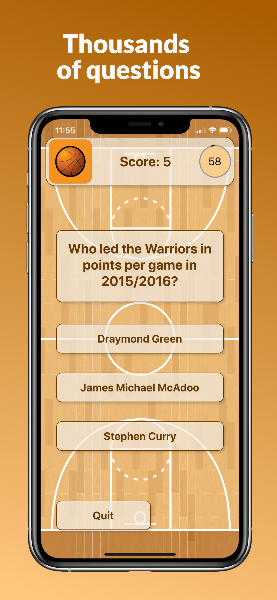
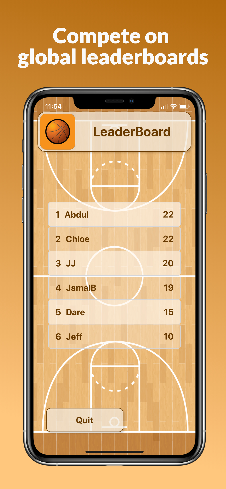
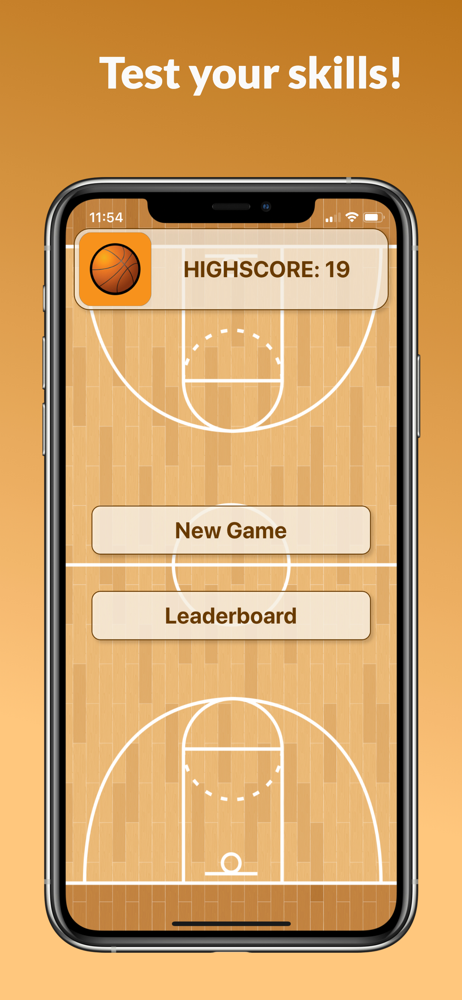

# NBA STAT TRIVIA
Test your knowledge of NBA stats and compete on global leaderboards with this fast-paced trivia game. Powered by React Native and Expo.
Available on the Google Playstore and the Apple App Store.

   

## Features
- [x] Beautiful and seamless UX built using React Native
- [x] Asycnhronously random-generated questions from NBA stats api
- [x] 90 second timed rounds for fast paced gameplay
- [x] Highscores stored locally using react-redux and redux-persist
- [x] Global leaderboards with anonymous authentication using Firebase, no email or social media required

## Requirements
- Expo: 37+
- React: 16+
- Full list can be found in the package.json file

## Installation
### App Stores
Full releases can be found on the [Google Play Store](https://play.google.com/store/apps/details?id=com.darebalogun.nba_stat_trivia) and the [Apple App Store](https://apps.apple.com/us/app/basketball-stat-trivia/id1512134576)

## Contributing
Please email/message me if you would like to contribute to this app
